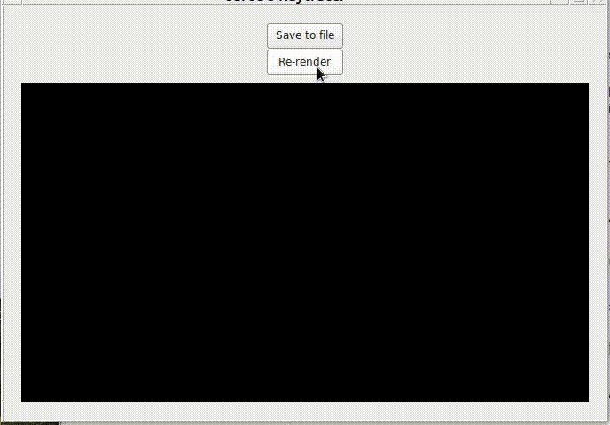

# jray - A Raytracer.

[](./scenes/scene.png)

An implementation of *The Ray Tracer Challenge* by Jamis Buck, written in C++11 with a simple GTK3 UI.
A "from scratch" implementation, it uses no special graphics or math libraries. Its only dependencies are GTK3, gtkmm, yaml-cpp and googletest.

Some of its features:

- Displays the render in progress
- Multithreaded
- All primitive shapes: Sphere, Cube, Plane, Cylinder, Cone
- Support for triangle meshes in OBJ format with surface normals
- Groups and Constructive Solid Geometry (CSG)
- Bounding boxes and a Bounding Volume Hierarchy (BVH) optimization for high polygon scenes
- Focal blur and antialiasing (supersampling)
- Patterns, including nested patterns
- Texture mapping on primitive shapes
- Area lights and soft shadows

While performance was not a major priority in this implementation, it does do pretty well at higher compiler optimization levels. Further improvements are planned.

# How to build
1. Obtain dependencies
You'll need CMake and the gtkmm libraries. This depends on your distribution.  
On Debian/Ubuntu:
`sudo apt install libgtkmm-3.0-dev cmake`
2. Clone the repo and pull the submodules  
```
git clone https://github.com/jpunzel/jray.git
cd jray
git submodule update --init --recursive
```
3. Create the build directory and run cmake
```
# (in jray dir)
mkdir build
cd build
cmake ..
```
4. Compile!
```
make -j4
```

TODO:
- [ ] Implement MTL parsing for texturing triangle meshes
- [ ] Implement bump mapping
- [ ] Fix numerous problems in the YAML scene file parser (likely needs a full rewrite)
- [ ] Optimization: Don't parse the same obj file multiple times (implement deep copy of Group object hierarchy)
- [ ] Performance: re-evaluate use of std::multiset for storing ray intersection lists
- [ ] Performance: re-evaluate use of std::shared_ptr
- [ ] Performance: Optimize matrix multiplication routines for SSE/AVX